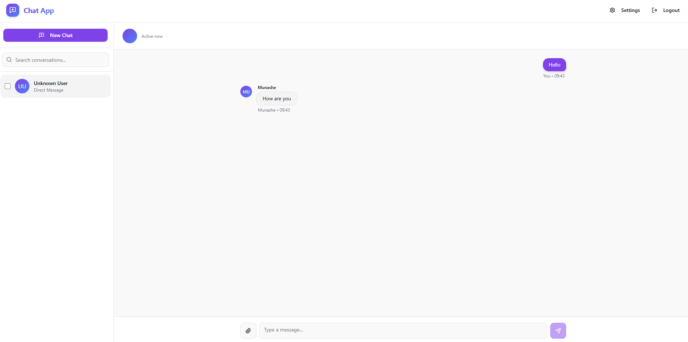
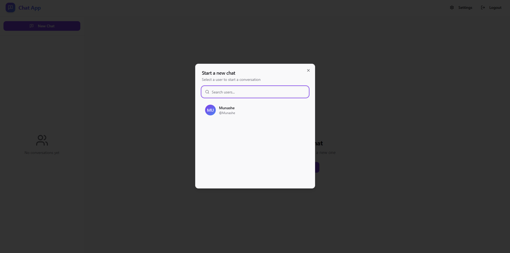
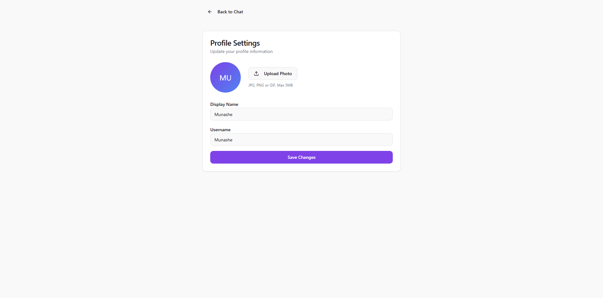

# 💬 Realtime Chat App

A production-ready **real-time chat application** built with **React** and **Supabase**, deployed on a personal **VPS (IONOS, AlmaLinux)** and live at:  
🔗 [https://realtimechat.munashemudabura.com/](https://realtimechat.munashemudabura.com/)


This project implements modern chat functionalities: authentication, one-on-one messaging, file attachments, and realtime delivery, through an elegant, responsive web interface.

> 🚧 **Note:** Mobile client support (React Native) is currently a work in progress.

---

## 🧩 Key Features

- 🔐 **Authentication:** Email/password signup and login using Supabase Auth.
- 💬 **Direct Messaging:** One-on-one private conversations between authenticated users.
- ⚡ **Realtime Messaging:** Messages delivered instantly through Supabase Realtime channels.
- 💾 **Persistent Storage:** All messages and user data stored in Supabase PostgreSQL.
- 🧍 **User Profiles:** Each user has a customizable profile with display name, username, and avatar.
- 📸 **Attachments:** Upload and view images via Supabase Storage.
- 🌓 **Responsive Interface:** Tailwind CSS ensures consistent behavior across all screen sizes.
- 🧱 **Secure Access:** Enforced Row-Level Security (RLS) for data isolation and user safety.
- 🔔 **Typing & Presence:** Realtime indicators for online users and typing activity.

---

## 🧠 Tech Stack

| Layer            | Technology                                   |
| ---------------- | -------------------------------------------- |
| Frontend         | React + Vite                                 |
| Styling          | Tailwind CSS                                 |
| State Management | React Context + Hooks                        |
| Backend          | Supabase (Auth, Database, Realtime, Storage) |
| Database         | PostgreSQL (via Supabase)                    |
| Hosting          | Personal VPS (IONOS) running AlmaLinux       |
| Deployment       | Nginx reverse proxy + Node build service     |

---

## 🌐 Live Demo

Visit the live deployed app:  
👉 **[https://realtimechat.munashemudabura.com/](https://realtimechat.munashemudabura.com/)**

---

## 📁 Folder Structure

```
realtime-chat-app/
│
├── public/                # Static assets
├── src/
│   ├── App.jsx            # Root component controlling routes and layout
│   ├── main.jsx           # Entry point (ReactDOM render)
│   ├── supabaseClient.js  # Supabase client initialization
│   │
│   ├── pages/
│   │   ├── Login.jsx      # Handles authentication (login/signup)
│   │   └── ChatPage.jsx   # Main chat layout (sidebar + chat area)
│   │
│   ├── components/
│   │   ├── ChatRoom.jsx         # Core chat window logic
│   │   ├── ConversationList.jsx # Sidebar list of active conversations
│   │   ├── MessageList.jsx      # Handles rendering message lists
│   │   ├── MessageBubble.jsx    # UI for individual messages
│   │   ├── Composer.jsx         # Input box and send button
│   │   └── ProfileEditor.jsx    # Profile editing UI
│   │
│   ├── context/
│   │   └── UserContext.jsx      # Global auth & session context
│   │
│   ├── hooks/
│   │   └── useConversation.js   # Custom hook for realtime message logic
│   │
│   └── styles/
│       └── tailwind.css         # Tailwind CSS configuration
│
├── .env.example            # Example environment variables
├── package.json
└── README.md
```

---

## ⚙️ Setup & Installation

### 1️⃣ Clone the Repository

```bash
git clone https://github.com/mudabs/realtime-chat-app.git
cd realtime-chat-app
```

### 2️⃣ Install Dependencies

```bash
npm install
```

### 3️⃣ Configure Environment Variables

Create a `.env` file in the project root directory:

```
VITE_SUPABASE_URL=https://your-project.supabase.co
VITE_SUPABASE_ANON_KEY=your-supabase-anon-key
```

If deploying on a VPS, ensure these variables are set in your environment or systemd service file.

### 4️⃣ Run the Development Server

```bash
npm run dev
```

This starts the app at:  
👉 [http://localhost:5173](http://localhost:5173)

### 5️⃣ Build for Production

```bash
npm run build
```

The optimized build files will be available in the `/dist` directory.  
You can serve them via **Nginx**, **Apache**, or any static web server.

---

## 🧠 System Functionality Overview

| Module            | Purpose                                                                                    |
| ----------------- | ------------------------------------------------------------------------------------------ |
| **Auth**          | Handles signup, login, logout, and session persistence using Supabase Auth.                |
| **Profiles**      | Stores user profile data (username, avatar, status).                                       |
| **Conversations** | Defines private 1-on-1 chat channels between users.                                        |
| **Messages**      | Stores messages with sender info, timestamps, and optional attachments.                    |
| **Realtime**      | Supabase Realtime channels push new messages instantly to connected clients.               |
| **Storage**       | Manages image uploads and file access using Supabase Storage.                              |
| **UI Layer**      | React components manage layout, user input, and dynamic updates through hooks and context. |

---

## 🖼️ Screenshots









Once uploaded, they will automatically render in this section.

---

## 📱 Mobile Client (Work in Progress)

A React Native version of the chat app is under development to bring parity with the web experience.  
Expected folder structure:

```
mobile-app/
├── App.js
├── screens/
│   ├── LoginScreen.js
│   ├── ChatListScreen.js
│   └── ChatRoomScreen.js
└── components/
    └── MessageBubble.js
```

---

## 🧩 Future Enhancements

- ✅ Dark mode & theme toggling
- ✅ Read receipts for message visibility
- ✅ Reactions & emojis
- ✅ Push notifications for new messages
- ✅ Improved caching & offline support
- ✅ Complete mobile implementation (React Native)

---

## 🧑‍💻 Contributing

Pull requests are welcome.  
Please fork the repository, create a feature branch, and submit a PR with clear documentation of your changes.

---

## 🧾 License

No license has been applied yet.

---
